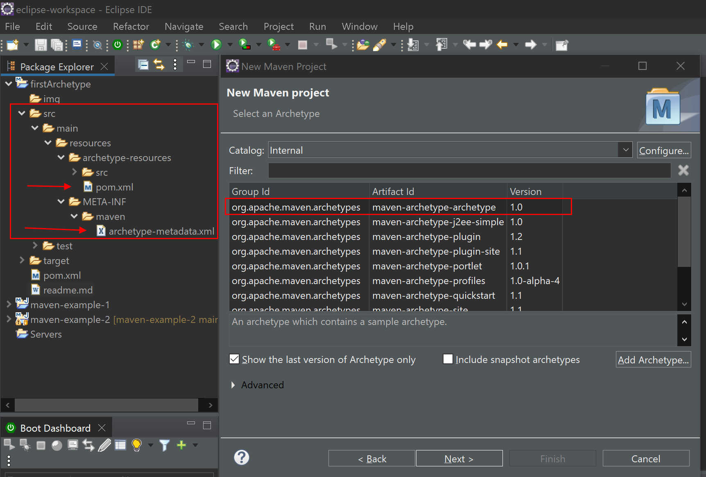
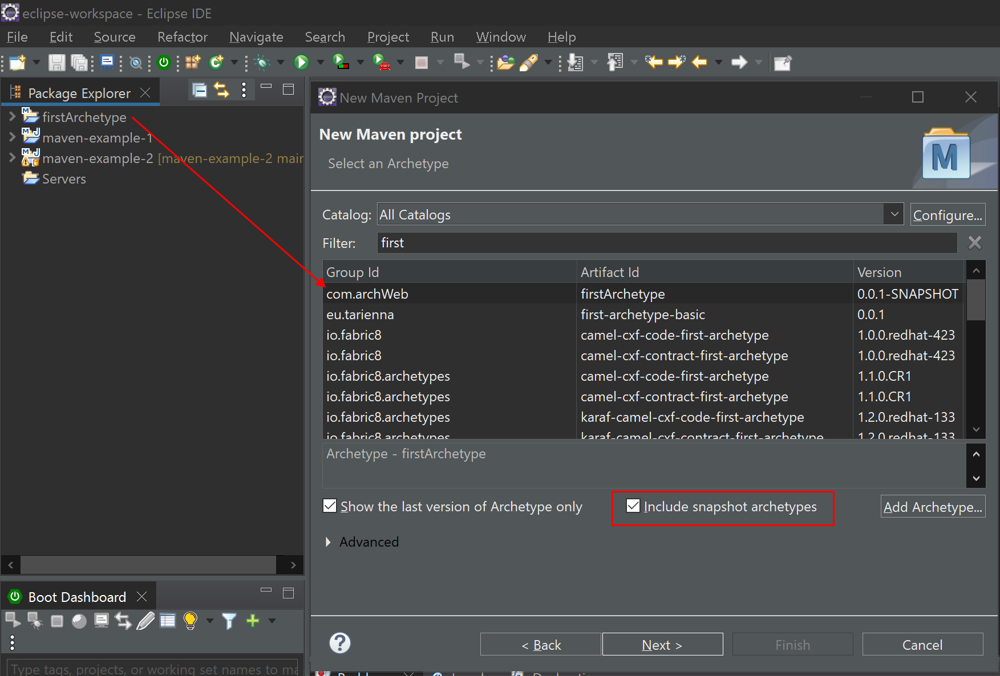

# Crear un Maven Archetype personalizado

# 1. Crear el proyecto base

En primer lugar necesitamos crear un nuevo proyecto maven del tipo *"archetype archetype"*, el cual es la plantilla comunmente utilizada para crear archetypes personalizados.

El proyecto resultante debe tener la siguiente estructura y contar con los dos archivos que están señalados en la imagen (si no están, los crea usted mismo)



# 2. *pom.xml*

**Nota**: es importante saber, que puede haber muchos "pom.xml" en un proyecto, y que, dependiendo de dónde estén situados, servirán para ciertas configuraciones u otras. Este pom no es el pom de la raiz del proyecto, si no el pom de la configuración inicial del proyecto al crearse éste.

Aquí pondremos las dependencias, extensiones, plugins, etc, que queramos que se añadan automáticamente cuando en el futuro creemos un nuevo proyecto con este archetype.

```xml
<?xml version="1.0" encoding="UTF-8"?>

<project xmlns="http://maven.apache.org/POM/4.0.0" xmlns:xsi="http://www.w3.org/2001/XMLSchema-instance" xsi:schemaLocation="http://maven.apache.org/POM/4.0.0 http://maven.apache.org/xsd/maven-4.0.0.xsd">
  <modelVersion>4.0.0</modelVersion>
  <groupId>${groupId}</groupId>
  <artifactId>${artifactId}</artifactId>
  <version>${version}</version>
  <packaging>war</packaging>

  <properties>
    <project.build.sourceEncoding>UTF-8</project.build.sourceEncoding>
    <maven.compiler.source>1.8</maven.compiler.source>
    <maven.compiler.target>1.8</maven.compiler.target>
  </properties>
  
  <name>${artifactId} Maven Webapp</name>
  <url>http://maven.apache.org</url>

  <dependencies>
    <dependency>
      <groupId>junit</groupId>
      <artifactId>junit</artifactId>
      <version>4.11</version>
      <scope>test</scope>
    </dependency>
    
    <dependency>
    	<groupId>javax.servlet</groupId>
    	<artifactId>javax.servlet-api</artifactId>
    	<version>4.0.1</version>
    </dependency>
    
	<dependency>
	    <groupId>org.postgresql</groupId>
	    <artifactId>postgresql</artifactId>
	    <version>42.5.0</version>
	</dependency>
	
	<dependency>
	    <groupId>org.hibernate</groupId>
	    <artifactId>hibernate-core</artifactId>
	    <version>5.6.12.Final</version>
	</dependency>
		
	<dependency>
	    <groupId>org.hibernate</groupId>
	    <artifactId>hibernate-entitymanager</artifactId>
	    <version>5.6.12.Final</version>
	</dependency>
  </dependencies>

  <build>
  	<extensions>
  		<extension>
	        <groupId>org.apache.maven.archetype</groupId>
	        <artifactId>archetype-packaging</artifactId>
	        <version>3.2.1</version>
    	</extension>
  	</extensions>
    
    <pluginManagement><!-- lock down plugins versions to avoid using Maven defaults (may be moved to parent pom) -->
      <plugins>
      	<plugin>
          <groupId>org.apache.maven.plugins</groupId>
          <artifactId>maven-archetype-plugin</artifactId>
          <version>3.2.1</version>
        </plugin>
        
      	<plugin>
            <groupId>org.apache.maven.plugins</groupId>
            <artifactId>maven-war-plugin</artifactId>
            <version>3.3.1</version>
        </plugin>
        
        <plugin>
          <artifactId>maven-clean-plugin</artifactId>
          <version>3.1.0</version>
        </plugin>
        
        <!-- see http://maven.apache.org/ref/current/maven-core/default-bindings.html#Plugin_bindings_for_jar_packaging -->
        <plugin>
          <artifactId>maven-resources-plugin</artifactId>
          <version>3.0.2</version>
        </plugin>
        
        <plugin>
          <artifactId>maven-compiler-plugin</artifactId>
          <version>3.8.0</version>
        </plugin>
        
        <plugin>
          <artifactId>maven-surefire-plugin</artifactId>
          <version>2.22.1</version>
        </plugin>
        
        <plugin>
          <artifactId>maven-jar-plugin</artifactId>
          <version>3.0.2</version>
        </plugin>
        
        <plugin>
          <artifactId>maven-install-plugin</artifactId>
          <version>2.5.2</version>
        </plugin>
        
        <plugin>
          <artifactId>maven-deploy-plugin</artifactId>
          <version>2.8.2</version>
        </plugin>
      </plugins>
    </pluginManagement>
    
    <finalName>${artifactId}</finalName>
  </build>
</project>
```

# 3. *archetype-metadata.xml*

Este archivo define la estructura principal inicial que un nuevo proyecto con este archetype debe tener al crearse.

```xml
<?xml version="1.0" encoding="UTF-8"?>

<!-- https://www.youtube.com/watch?v=U3AvNVT5j8w -->

<!--
Licensed to the Apache Software Foundation (ASF) under one
or more contributor license agreements.  See the NOTICE file
distributed with this work for additional information
regarding copyright ownership.  The ASF licenses this file
to you under the Apache License, Version 2.0 (the
"License"); you may not use this file except in compliance
with the License.  You may obtain a copy of the License at

  http://www.apache.org/licenses/LICENSE-2.0

Unless required by applicable law or agreed to in writing,
software distributed under the License is distributed on an
"AS IS" BASIS, WITHOUT WARRANTIES OR CONDITIONS OF ANY
KIND, either express or implied.  See the License for the
specific language governing permissions and limitations
under the License.
-->

<archetype-descriptor xmlns="http://maven.apache.org/plugins/maven-archetype-plugin/archetype-descriptor/1.0.0" xmlns:xsi="http://www.w3.org/2001/XMLSchema-instance"
  xsi:schemaLocation="http://maven.apache.org/plugins/maven-archetype-plugin/archetype-descriptor/1.0.0 http://maven.apache.org/xsd/archetype-descriptor-1.0.0.xsd"
  name="${artifactId}">

  <fileSets>
  <!-- 
    <fileSet filtered="true" packaged="true" encoding="UTF-8">
    	<directory>src/main/java/Main</directory>
    </fileSet>
   -->
    <fileSet filtered="true" packaged="true" encoding="UTF-8">
    	<directory>src/main/java/Controllers</directory>
    </fileSet>
    
    <fileSet filtered="true" packaged="true"  encoding="UTF-8">
    	<directory>src/main/java/Models/Connections</directory>
    </fileSet>
    
    <fileSet filtered="true" packaged="true" encoding="UTF-8">
    	<directory>src/main/java/Main</directory>
    </fileSet>
    
    <fileSet filtered="true" packaged="true" encoding="UTF-8">
    	<directory>src/main/java/Models/CRUD</directory>
    </fileSet>
    
    <fileSet filtered="true" packaged="true" encoding="UTF-8">
    	<directory>src/main/java/Models/DTOs</directory>
    </fileSet>
    
    <fileSet filtered="true" packaged="true" encoding="UTF-8">
    	<directory>src/main/java/Models/Queries</directory>
    </fileSet>
    
    <fileSet filtered="true" packaged="true" encoding="UTF-8">
    	<directory>src/main/java/Models/ToDTOs</directory>
    </fileSet>
    
    <fileSet filtered="true" packaged="true" encoding="UTF-8">
    	<directory>src/main/java/Models/Utils</directory>
    </fileSet>
    
    <fileSet filtered="true" packaged="true" encoding="UTF-8">
    	<directory>src/main/resources</directory>
    </fileSet>
    
    <fileSet filtered="true" packaged="true" encoding="UTF-8">
    	<directory>src/test/java</directory>
    </fileSet>
    
    <fileSet filtered="true" packaged="true" encoding="UTF-8">
    	<directory>src/test/resources</directory>
    </fileSet>
    
    <fileSet filtered="true" packaged="true" encoding="UTF-8">
    	<directory>target/generated-sources/annotations</directory>
    </fileSet>
        
    <fileSet filtered="true" packaged="true" encoding="UTF-8">
        <directory>target/generated-test-sources/test-annotations</directory>
    </fileSet>    
  </fileSets>
  
</archetype-descriptor>
```

# 4. Crear el archetype

Ahora tan solo tenemos que dirigirnos adentro de este proyecto con nuestra consola (cmd por ejemplo), y ejecutar el comando de `mvn install`, y de este modo se habrá generado nuestro archetype correctamente.

Si necesitasemos hacer más cambios en los archivos xml de antes, haríamos un `mvn clean` antes de volver a ejecuatar el `mvn install`.

Para crear proyectos a través de nuestro archetype, para que salga en el desplegable de maven, necesitamos marcar la casilla de *"□ include snapshot archetypes"*.

